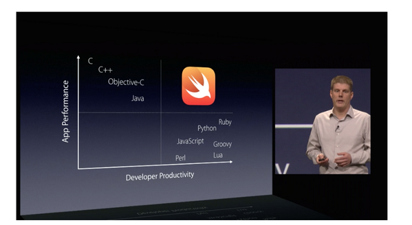

% Hello, Rust!


@steveklabnik

# Meta

Rust is a new programming language from Mozilla (and friends).

Rust is a _low-level_ programming language that often feels like a _high level_
one.

Rust makes low-level programming **accessible** to those who haven't done it, and
**safer** for those who have.

# Tradeoffs



# Safety?

Let's talk about **safety**.

Low level programming has historically been very, very, very unsafe.

# Safety?

Here's some Ruby:

```ruby
v = [];

v.push("Hello");

x = v[0];

v.push("world");

puts x
```

# Safety?

Here's some C++:

```cpp
#include<iostream>
#include<vector>
#include<string>

int main() {
    std::vector<std::string> v;

    v.push_back("Hello");

    std::string& x = v[0];

    v.push_back("world");

    std::cout << x;
}
```

# Safety?

```bash
$ g++ hello.cpp -Wall -Werror
$ ./a.out 
Segmentation fault (core dumped)
```

# Safety?

```cpp
int main() {
    std::vector<std::string> v;
```

| location | name | value |
|----------|------|-------|
| 0x30     | v    |       |


# Safety?

```cpp
v.push_back("Hello");
```

| location | name | value    |
|----------|------|----------|
| 0x30     | v    | 0x18     |
| 0x18     |      | "Hello"  |

# Safety?

```cpp
std::string& x = v[0];
```

| location | name | value    |
|----------|------|----------|
| 0x30     | v    | 0x18     |
| 0x18     |      | "Hello"  |
| 0x14     | x    | 0x18     |


# Safety?

```cpp
v.push_back("world");
```

| location | name | value    |
|----------|------|----------|
| 0x30     | v    | 0x08     |
| 0x18     |      | GARBAGE  |
| 0x14     | x    | 0x18     |
| 0x08     |      | "Hello"  |
| 0x04     |      | "world"  |

# Safety?

> If the new `size()` is greater than `capacity()` then all iterators and
> references (including the past-the-end iterator) are invalidated.

# Safety?

```{rust,ignore}
fn main() {
    let mut v = vec![];

    v.push("Hello");

    let x = &v[0];

    v.push("world");

    println!("{}", x);
}
```

# Safety?

```{notrust,ignore}
error: cannot borrow `v` as mutable because it is also borrowed as immutable
v.push("world");
^
```

# Safety?

```{notrust,ignore}
note: previous borrow of `v` occurs here; the immutable borrow prevents subsequent moves or mutable borrows of `v` until the borrow ends
let x = &v[0];
^
```

# Safety?

```{rust}
fn main() {
    let mut v = vec![];

    v.push("Hello");

    let x = v[0].clone();

    v.push("world");

    println!("{}", x);
}
```

# Safety?

```{rust,ignore}
fn main() {
    let mut numbers = vec![1i, 2i, 3i];

    for i in range(0u, 3u) {
        spawn(proc() {
            for j in range(0, 3) {
                numbers[j] += 1
            }
        });
    }
}
```

# Safety?

```{notrust,ignore}
6:71 error: capture of moved value: `numbers`
    for j in range(0, 3) { numbers[j] += 1 }
               ^~~~~~~
7:50 note: `numbers` moved into closure environment here because it has type `proc():Send`, which is non-copyable (perhaps you meant to use clone()?)
    spawn(proc() {
```

# Safety?

```rust
use std::sync::{Arc,Mutex};

fn main() {
    let numbers = Arc::new(Mutex::new(vec![1i, 2i, 3i]));

    for i in range(0u, 3u) {
        let number = numbers.clone();

        spawn(proc() {
            let mut array = number.lock();

            (*array)[i] += 1;

            println!("numbers[{}] is {}", i, (*array)[i]);
        });
    }
}
```

# Safety?

```{rust,ignore}
fn main() {
    let numbers = Arc::new(Mutex::new(vec![1i, 2i, 3i]));

    for i in range(0u, 3u) {
        let number = numbers.clone();

        spawn(proc() {
            // ...
        });
    }
}
```

# Safety?

```{rust,ignore}
spawn(proc() {
    let mut array = number.lock();

    (*array)[i] += 1;

    println!("numbers[{}] is {}", i, (*array)[i]);
});
```

# Accessibility

Systems programming has kept the same tools for decades.

Rust uses tooling that is inspired by Ruby and JavaScript.

# Cargo

```{bash}
$ cargo new hello_world --bin
$ cd hello_world
$ tree .
.
├── Cargo.toml
└── src
    └── main.rs

1 directory, 2 files
```

# Cargo

```{toml}
[package]

name = "hello_world"
version = "0.0.1"
authors = ["Your Name <you@example.com>"]
```

```{rust}
fn main() {
    println!("Hello, world!")
}
```

# Cargo

```{bash}
$ cargo run
   Compiling hello_world v0.0.1 (file:///Users/you/src/hello_world)
     Running `target/hello_world`
Hello, world!
```

# Cargo

```{toml}
[package]

name = "hello_world"
version = "0.0.1"
authors = ["Your Name <someone@example.com>"]

[dependencies.semver]

git = "https://github.com/rust-lang/semver.git"
```

```{bash}
$ cargo run
    Updating git repository `https://github.com/rust-lang/semver.git`
   Compiling semver v0.0.1 (https://github.com/rust-lang/semver.git#bf739419)
   Compiling hello_world v0.0.1 (file:///home/you/projects/hello_world)
     Running `target/hello_world`
Hello, world!
```

# Zero Cost Abstraction

```rust
fn main() {
    let xs = [1, 2, 3, 4, 5];

    let mut xs = xs.iter()
	           .map(|x| x + 1 )
	           .filter(|x| x % 2i == 0 );

    let xs: Vec<int> = xs.collect();
}
```

# Thanks!


Rust makes low-level programming **accessible** to those who haven't done it, and
**safer** for those who have.

@steveklabnik
